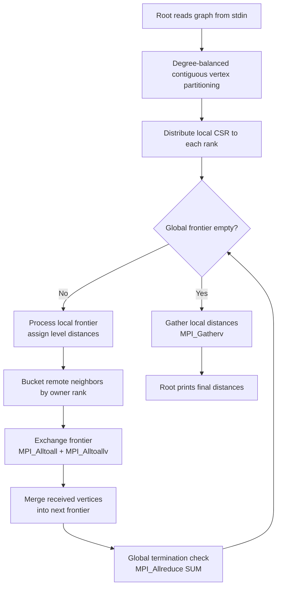
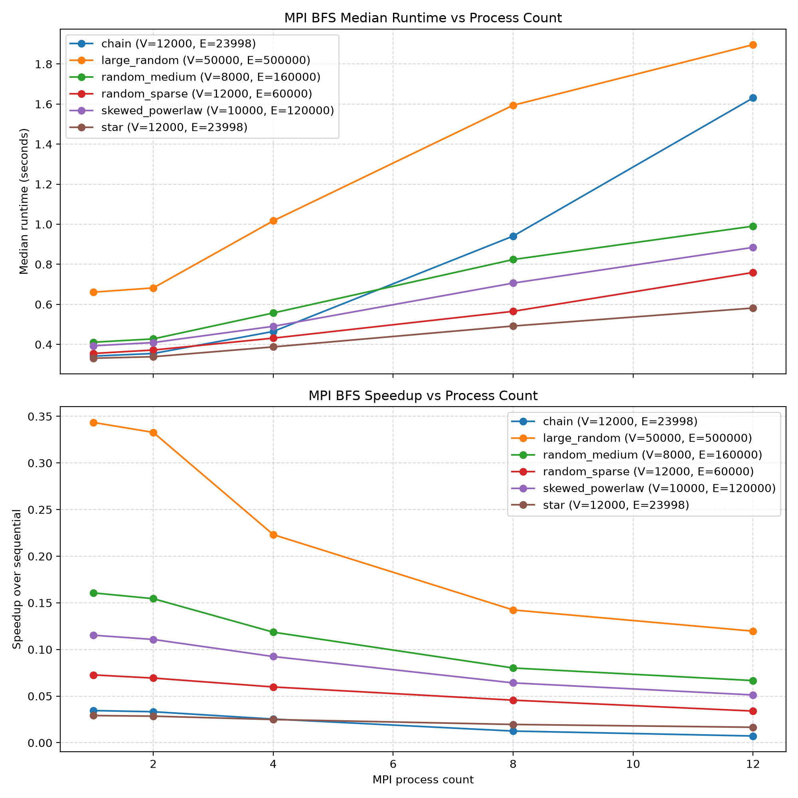

# Parallel BFS with MPI

[](https://github.com/laharisirisetti/Parallel-BFS-MPI/actions/workflows/ci.yml)
[](LICENSE)
[](https://en.cppreference.com/w/cpp/17)
[](https://www.open-mpi.org/)

A distributed-memory **Breadth-First Search** that computes single-source shortest-path (hop) distances across MPI processes, backed by a sequential reference implementation, a deterministic correctness suite, and a reproducible benchmark study.

> Built to explore how graph traversal scales under distributed-memory parallelism — and to characterize, honestly, the regime where it does and does not pay off.

## Table of Contents

- [Overview](#overview)
- [Features](#features)
- [Architecture](#architecture)
- [Repository Layout](#repository-layout)
- [Getting Started](#getting-started)
- [Usage](#usage)
- [Testing](#testing)
- [Benchmarks](#benchmarks)
- [How It Works](#how-it-works)
- [Roadmap](#roadmap)
- [License](#license)

## Overview

Given a directed graph and a source vertex, BFS computes the minimum number of edges (hops) from the source to every other vertex; unreachable vertices are reported as `-1`. This repository provides two implementations:

- **Sequential BFS** — a classic queue-based traversal used as a correctness oracle and performance baseline.
- **Parallel BFS (MPI)** — a level-synchronous distributed traversal. Vertices are partitioned across ranks; each rank owns a contiguous vertex range stored in **CSR** form, exchanges newly discovered non-local vertices through collective communication each level, and detects global termination cooperatively.

## Features

- **Level-synchronous distributed BFS** over `MPI_COMM_WORLD`.
- **Degree-balanced contiguous vertex partitioning** — balances the number of _edges_ per rank (not just vertices) so that dense hubs don't overload a single process.
- **CSR (Compressed Sparse Row)** local graph representation for cache-friendly neighbor iteration.
- **Sparse frontier exchange** via `MPI_Alltoall` (counts) + `MPI_Alltoallv` (data) — every rank sends only the vertices actually owned by each peer.
- **Deadlock-free global termination** using `MPI_Allreduce` over frontier sizes, avoiding the classic "one rank finishes early and others hang" failure mode.
- **Deterministic correctness suite** (10 cases) validated against the sequential oracle across `1, 2, 3, 4, 8, 12` ranks.
- **Reproducible benchmark harness** with graph generators, timing, and plotting.

## Architecture



## Repository Layout

```
Parallel-BFS-MPI/
├── src/
│   ├── sequential_bfs.cpp     # Baseline queue-based BFS (correctness oracle)
│   └── parallel_bfs.cpp       # Distributed level-synchronous BFS (MPI)
├── docs/
│   └── design.md              # Design notes and reasoning
├── tests/
│   ├── cases/                 # Deterministic correctness inputs
│   ├── expected/              # Golden correctness outputs
│   └── run_tests.py           # Correctness test runner
├── benchmarks/
│   ├── graphs/                # Generated benchmark inputs
│   ├── expected/              # Golden benchmark outputs
│   ├── results/               # Canonical CSV + optimization history
│   ├── plots/                 # Generated benchmark visualizations
│   ├── benchmark.py           # Benchmark runner
│   ├── generate_graphs.py     # Reproducible graph generator
│   └── plot_results.py        # CSV plotting utility
├── CMakeLists.txt             # Build system
├── .github/workflows/ci.yml   # Build + test on every push
└── LICENSE
```

## Getting Started

### Prerequisites

- A C++17 compiler (`g++` or `clang++`)
- An MPI implementation ([OpenMPI](https://www.open-mpi.org/) or [MPICH](https://www.mpich.org/))
- [CMake](https://cmake.org/) ≥ 3.16
- Python ≥ 3.8 (only for the test/benchmark scripts)

> **Windows users:** the MPI toolchain targets Linux/macOS. Use [WSL2](https://learn.microsoft.com/windows/wsl/install) (Ubuntu) and install the dependencies with:
>
> ```bash
> sudo apt-get update && sudo apt-get install -y build-essential cmake openmpi-bin libopenmpi-dev
> ```

### Build

```bash
cmake -S . -B build -DCMAKE_BUILD_TYPE=Release
cmake --build build --parallel
```

The executables are written to `build/bin/`:

- `build/bin/sequential_bfs`
- `build/bin/parallel_bfs`

## Usage

### Input format

```
V E S
u1 v1
u2 v2
...
uE vE
```

- `V` — number of vertices (labeled `0 .. V-1`)
- `E` — number of directed edges
- `S` — source vertex
- Each subsequent line is a directed edge `u → v`

### Output

A single line of `V` space-separated distances (hops from the source), where `-1` marks an unreachable vertex.

### Example

Input:

```
4 4 0
0 1
0 2
1 3
2 3
```

Output:

```
0 1 1 2
```

### Run the sequential baseline

```bash
./build/bin/sequential_bfs < tests/cases/10_complex.txt
```

### Run the parallel version (e.g. 4 ranks)

```bash
mpirun -np 4 ./build/bin/parallel_bfs < tests/cases/10_complex.txt
```

## Testing

The correctness suite compiles both implementations, runs every deterministic case, and asserts the parallel output matches the sequential oracle across multiple process counts (`1, 2, 3, 4, 8, 12`):

```bash
python3 tests/run_tests.py
```

## Benchmarks

### Methodology

- **Graph families:** `chain`, `star`, `random_sparse`, `random_medium`, `skewed_powerlaw`, `large_random`.
- **Timing:** median of 5 measured runs after 1 warm-up run.
- **Metric:** end-to-end wall-clock time, including MPI startup, graph distribution, and result gathering.

Reproduce:

```bash
python3 -m pip install -r benchmarks/requirements.txt
python3 benchmarks/generate_graphs.py   # regenerate benchmark inputs
python3 benchmarks/benchmark.py         # time sequential vs parallel -> CSV
python3 benchmarks/plot_results.py      # render the scaling plot
```



### Results (median seconds)

| Graph (V, E)                | Sequential |  np=1 |  np=2 |  np=4 |  np=8 | np=12 |
| --------------------------- | ---------: | ----: | ----: | ----: | ----: | ----: |
| star (12k, 24k)             |     0.0096 | 0.331 | 0.339 | 0.388 | 0.492 | 0.581 |
| chain (12k, 24k)            |     0.0118 | 0.342 | 0.355 | 0.465 | 0.941 | 1.630 |
| random_sparse (12k, 60k)    |     0.0258 | 0.355 | 0.372 | 0.431 | 0.565 | 0.759 |
| skewed_powerlaw (10k, 120k) |     0.0453 | 0.393 | 0.409 | 0.490 | 0.706 | 0.884 |
| random_medium (8k, 160k)    |     0.0660 | 0.411 | 0.427 | 0.557 | 0.824 | 0.990 |
| large_random (50k, 500k)    |     0.2269 | 0.661 | 0.682 | 1.017 | 1.594 | 1.896 |

_All parallel runs were verified correct against the sequential oracle._

### What the numbers show (and why)

This is a deliberately honest read of the data:

1. **Correctness holds everywhere** — across all six graph families and every process count from 1 to 12.
2. **At these sizes the sequential baseline wins.** Parallel speedup stays below `1.0` and _degrades_ as ranks increase.
3. **There is a ~0.33 s floor** on every parallel run, even at `np=1`. That floor is MPI initialization plus the per-level collective operations, and it dwarfs the microsecond-to-millisecond cost of the actual traversal.
4. **Adding ranks adds communication, not throughput** here. Level-synchronous BFS performs `O(depth)` global synchronizations; each level's compute is tiny, so latency-bound `MPI_Allreduce` / `MPI_Alltoallv` rounds dominate — and on a single oversubscribed machine, extra ranks contend for the same physical cores.

**Where this design would pay off:** far larger graphs (tens of millions of edges, so per-level compute exceeds communication), genuine distributed hardware instead of oversubscribed cores, and overlapping communication with computation. This is the classic strong-scaling wall for small/medium graphs on commodity hardware — a limitation of the workload and environment, not of the algorithm's correctness.

The CSVs under [`benchmarks/results/`](benchmarks/results/) trace the optimization journey — `baseline` → degree-balanced contiguous vertex partitioning → direct CSR construction → send-side de-duplication → local-only visited/distance state → `final` — each step trimming measurable overhead.

## How It Works

1. **Read** — the root process reads `V E S` and the edge list from stdin.
2. **Partition** — vertices are split using **degree-balanced contiguous vertex partitioning**: a cumulative out-degree prefix sum selects contiguous ranges so each rank owns a similar number of edges.
3. **Distribute** — each rank receives its local subgraph as CSR (`offsets` + `csr`) via point-to-point sends; shared metadata (`vertexCount`, `sourceVertex`, `partitionOffsets`) is broadcast.
4. **Traverse** — the rank owning the source seeds the frontier. Each level, every rank expands its local frontier: locally owned neighbors go straight into the next frontier; remote neighbors are bucketed by owner.
5. **Exchange** — buckets are swapped in one shot with `MPI_Alltoall` (counts) + `MPI_Alltoallv` (payload).
6. **Terminate** — an `MPI_Allreduce` sum of frontier sizes yields the global frontier size; the loop ends when it reaches zero, so no rank can hang waiting on a peer.
7. **Gather** — local distance arrays are collected to the root with `MPI_Gatherv` and printed.

See [`docs/design.md`](docs/design.md) for the full reasoning behind these decisions.

## Roadmap

- [ ] Replace `#include <bits/stdc++.h>` with standard headers; split into translation units.
- [ ] Add `clang-format` / `clang-tidy` and wire them into CI.
- [ ] Add a `Dockerfile` for a one-command reproducible MPI environment.
- [ ] Overlap communication with computation using non-blocking collectives.
- [ ] Explore direction-optimizing (push/pull) BFS for high-diameter and hub-heavy graphs.
- [ ] Scale-test on a real multi-node cluster to measure true strong/weak scaling.

## License

Released under the [MIT License](LICENSE).
